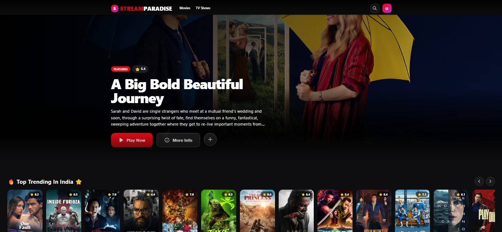
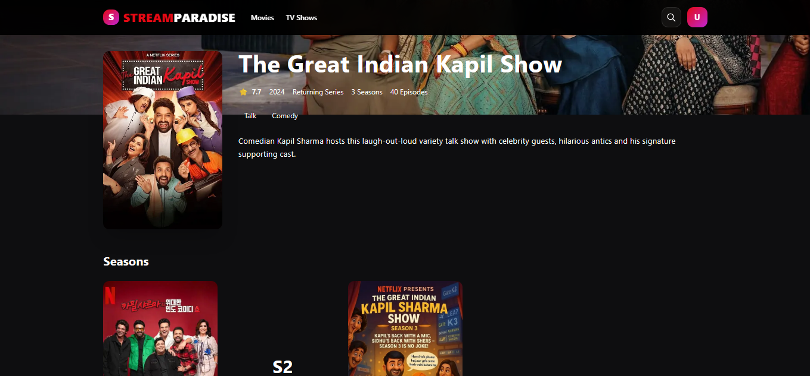
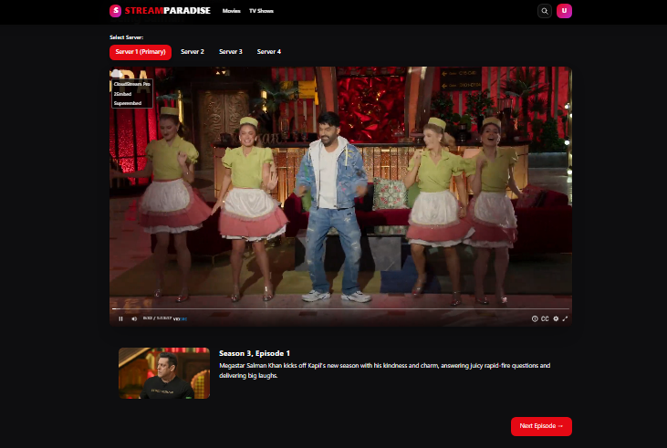

# 🎬 StreamParadise

Premium streaming platform for movies and TV shows with TMDB integration and multiple embed servers.

## ✨ Features

- 🎥 **Movies & TV Shows** - Browse, search, and watch from TMDB's extensive catalog
- 📺 **Episode Navigation** - Seamless season/episode browsing with thumbnails
- 🎮 **Multiple Servers** - 4 reliable embed servers for optimal streaming
- 🎯 **Instant Playback** - Videos start in seconds
- 🔍 **Smart Search** - Search both movies and TV shows
- 🎨 **Beautiful UI** - Modern, responsive design
- ✨ **Anime Section** - Dedicated trending anime section

## Screenshots




## 🚀 Quick Start

### 1. Install Dependencies
```bash
npm install
```

### 2. Environment Setup


████████████████████████████████████████████████████████████████████████████████████████████████
 *                                                                                                
 *  🚨  C R I T I C A L      S E T U P      I N S T R U C T I O N S  🚨                                 
 *                                                                                                
 *  ────────────────────────────────────────────────────────────────────────────────────────────
 *  🔹 BLOCK 1: FOR TV EPISODES
 *  ────────────────────────────────────────────────────────────────────────────────────────────
 *   { 
 *     name: 'Server (Primary)', 
 *     url: (id, s, e) => 'YOUR_EMBED_URL/' + id + '/' + s + '/' + e 
 *   }
 *   📁 Location: app/watch/tv/[id]/[season]/[episode]/WatchTVPageClient.tsx
 *                                                                                                
 *  ────────────────────────────────────────────────────────────────────────────────────────────
 *  🔹 BLOCK 2: FOR MOVIES
 *  ────────────────────────────────────────────────────────────────────────────────────────────
 *   {
 *     name: 'Server (Primary)', 
 *     url: (id) => 'YOUR_EMBED_URL/' + id 
 *   }
 *   📁 Location: app/watch/[id]/WatchMoviePageClient.tsx
 *                                                                                                
 *  ────────────────────────────────────────────────────────────────────────────────────────────
 *  🔹 BLOCK 3: API KEY SETUP
 *  ────────────────────────────────────────────────────────────────────────────────────────────
 *   🔑  Get your TMDB API key from:
 *       👉  https://www.themoviedb.org/settings/api
 *
 *   ⚠️  Replace "YOUR_EMBED_URL" with your actual embed endpoint.
 *   ⚠️  Without this, video playback WILL NOT WORK.
 *
 *  ────────────────────────────────────────────────────────────────────────────────────────────
 *                                                                                                
 *  ✅ REQUIRED for both movie & TV streaming functionality.
 *                                                                                                
████████████████████████████████████████████████████████████████████████████████████████████████


### 3. Run Development Server
```bash
npm run dev
```

Open http://localhost:3000 in your browser.

## 📁 Project Structure

```
app/
├── page.tsx                    # Movies homepage
├── tv/
│   ├── page.tsx               # TV shows homepage
│   └── [id]/
│       ├── page.tsx           # Show details + seasons
│       └── season/[season]/
│           └── page.tsx       # Episodes list
├── watch/
│   ├── [id]/
│   │   ├── page.tsx           # Movie watch page
│   │   └── WatchMoviePageClient.tsx
│   └── tv/[id]/[season]/[episode]/
│       ├── page.tsx           # TV watch page
│       └── WatchTVPageClient.tsx
└── movie/[id]/page.tsx        # Movie details

components/
├── Navbar.tsx                 # Main navigation
├── SettingsDrawer.tsx         # Settings panel
└── ...

lib/
└── tmdb.ts                    # TMDB API integration
```

## 🎮 Servers

The platform can uses reliable embed servers for optimal streaming quality. IYKYK 😉😜


## 🛠️ Available Scripts

```bash
npm run dev        # Start development server
npm run build      # Production build
npm run start      # Run production server
npm run lint       # Run ESLint
npm run type-check # TypeScript type checking
```

## 📝 Usage

### Watch Movies
1. Browse movies on homepage
2. Click any movie poster
3. Click "Watch Now" button
4. Select a server if default doesn't work

### Watch TV Shows
1. Navigate to `/tv` page
2. Click any show → Select season → Click episode
3. Use "Next Episode" button to continue watching

### Search
- Click search icon in navbar
- Type movie or show name
- Results appear for both movies and TV shows


## 🔧 Technologies

- **Next.js 14** - App Router, Server Components
- **TypeScript** - Type safety
- **Tailwind CSS** - Styling
- **TMDB API** - Movie/TV metadata

## � License

This project is for educational purposes only.
